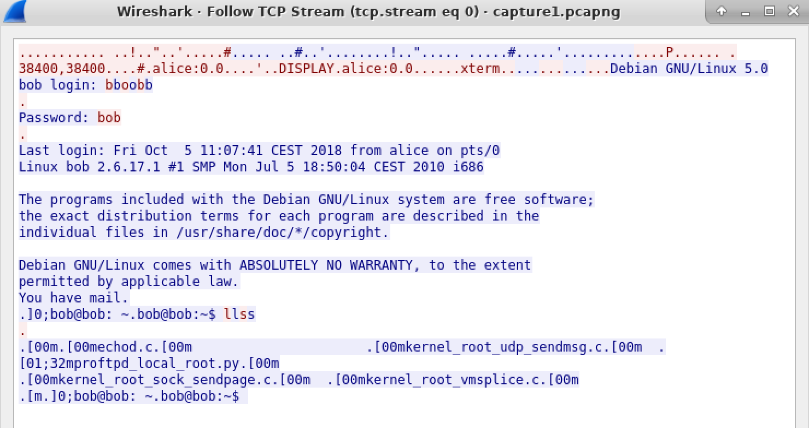
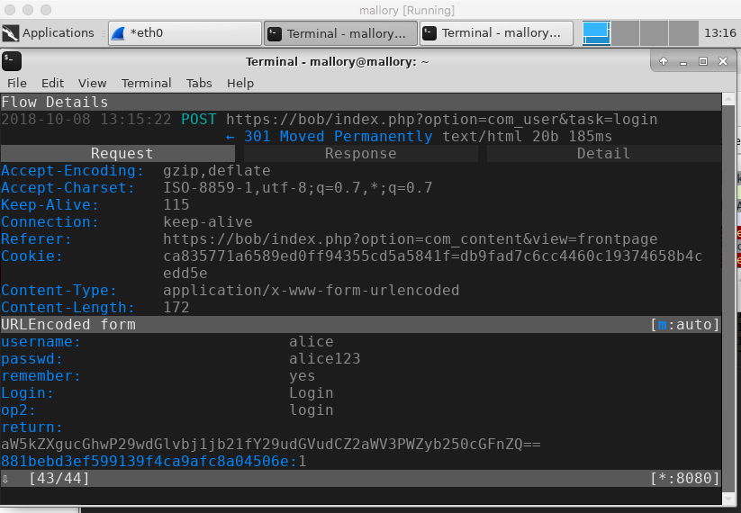

## Assignment 2

### Part A

When inspecting the packets in wireshark, we find a packet which has Telnet: `Data: Password:`. The next packet would then consist of the password, and through wireshark we analyze the packet and follows the TCP stream. From this we get the login credentials.

### Part B

Since TLS uses synchronized encryption, with a private key obtained through a key sharing algorithm, for instance Diffie-Helman, it's not possible to decrypt the traffic.

### Part C

When inspecting the results from the keylog, we find a HTTP-POST-request, which contains Alice's log-in credentials. Since these are not encrypted on the client side, Mallory can read these as plain-text. 

I