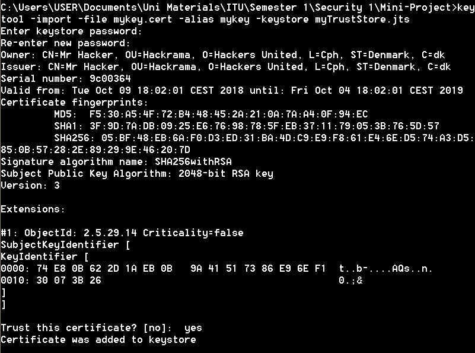

Group A Report

## Assignment 1 

### Setting up the connection:

The assignment is about establishing a secure connection between a client and a server using the predefined port 7007.

Our implemenentation makes use of the provider defined in the JSSE (Java Secure Socket Extension).

We chose this provider because it supports both SSL and TLS protocols. This way, they add a level of security when we establish a connection between the two entities. Among others, it includes functionalities related to:

- Data encryption

- Server authentication

- Client authentication

- Message integrity 

  ​																

  After a secure connection is established, TCP protocol is used to transmit messages back and forth between the client and the server.

The steps needed to create the connection are as follows:

- Firstly we generate a certificate for both entities as they are needed for the Handshake part of the connection. In this part, both entities agree on the parameters required to make the connection such as : 
  - Session ID

  - Compression method

  - Cipher Suite etc.

    

    

    

- After the environment is set up and handshake phase is completed, the two entities can exchange messages using the Secure Socket Layer as long as the client doesn't wish to terminate the connection.
- During the communication, the client writes messages that the server receives and sends back to the client. This is done to verify that the message remains unchanged from the moment it sent by the client until it is received by the server, thus we have ensured data integrity.
