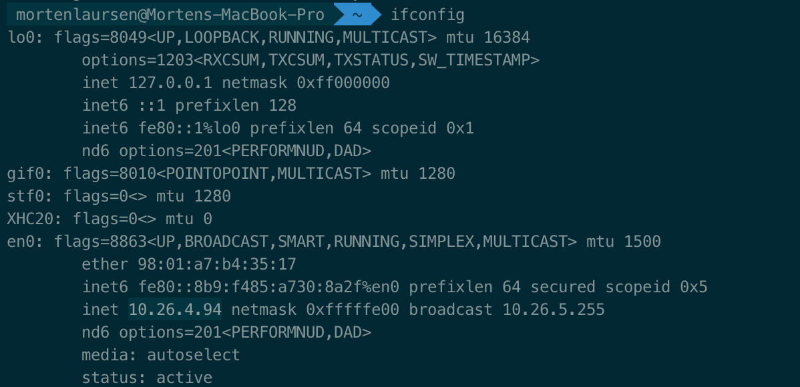
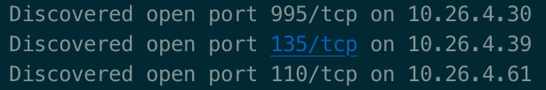
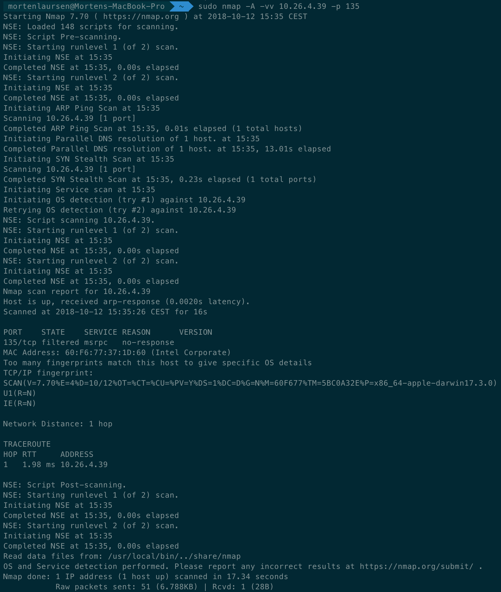
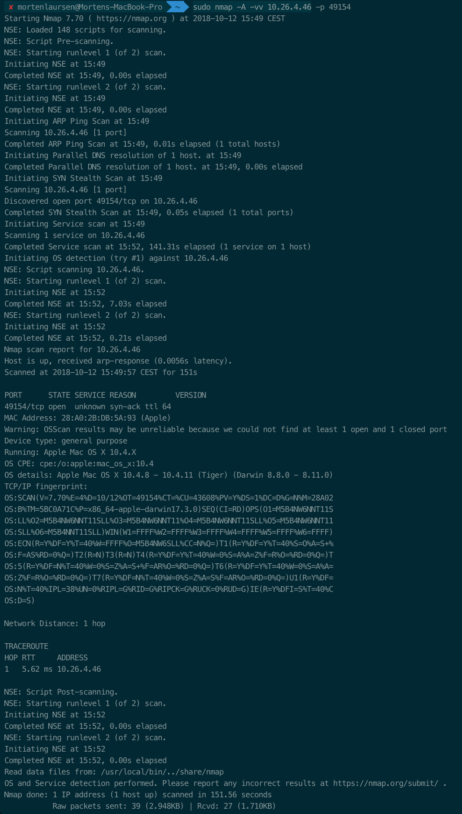
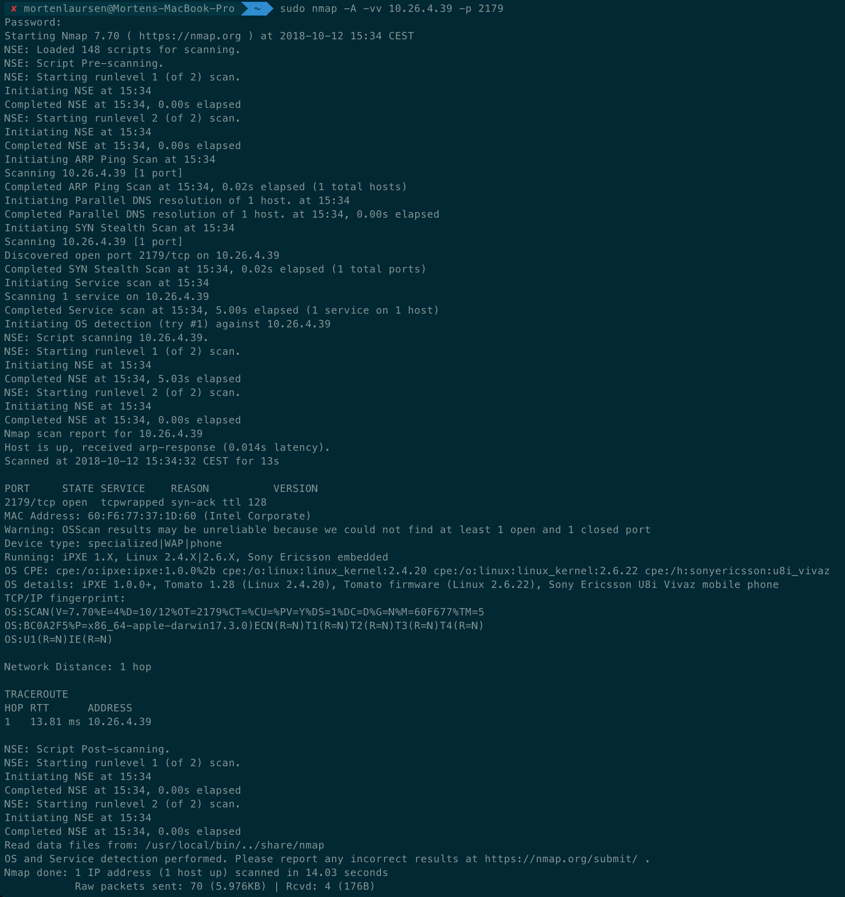

### Assignment 1: Port Scanning

Initially we ran ifconfig to figure out our IP-address. 

In this case out ip were _10.26.4.94_. Since the last number refers to our own computer, we next ran a scan on the local network using the three first numbers and then the range 0 - 255

`nmap 10.26.4.0-255 -vv`

The -vv is the _very verbose_ flag which outputs additional information. 

This gave us a long list of servers formatted like this

On this list we looked for atypical open port numbers and ran our comprehensive scan on these. 

The first line on the screenshots underneath is the command we ran, with the following format

`sudo nmap -A -vv 11.22.33.44 -p 123`

sudo is used to run the code as a superuser. This enables us to run it with the _-A_ flag, which enables OS detection, version detection, script scanning, and traceroute. The _-vv_ flag has already been explained. The _-p_ flag specifies a specific port. So we run the command on a specific ip on a specific port.

**Port 135**

The port number 135 is usually the Remote Procedure Call (RPC) port. Since nmap is unable to detect the OS for what ever reason, it's unclear how to exploit this open port.

**Port 49154**

Port 49154 is a custom port which isn't reserved for anything. Since we determine the OS to Mac OS X 10.4.11 (assumed highest version), we can exploit this server by using one of the exploits found on this link: https://www.cvedetails.com/vulnerability-list/vendor_id-49/product_id-156/version_id-42310/year-2018/Apple-Mac-Os-X-10.4.11.html

**Port 2179**

Port 2179 is also not reserved for any particular service, and in this case is a _tcpwrapper_. A tcpwrapper is a host-based network access control program on Unix and Linux, which actually protects some program. 

> What you are probably seeing is a network security device like a firewall or IPS. Many of these are configured to respond to TCP portscans, even for IP addresses which are not assigned to them. This behavior can slow down a port scan and cloud the results with false positives.

From https://security.stackexchange.com/questions/23407/how-to-bypass-tcpwrapped-with-nmap-scan

According to the scan above, the device is a _Sony Ericsson u8i Vivaz mobile phone_ but this is probably not the case, since we probably are talking to a firewall. This issue is referenced in an open nmap issue: https://github.com/nmap/nmap/issues/914

